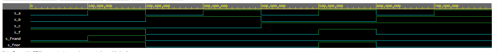
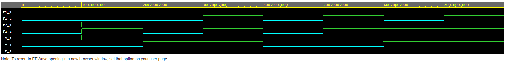

# 01 - gates
[Odkaz na github](https://github.com/xmarak02/Digital-electronics-1)
## De Morgan
   &nbsp;

      &nbsp;
### VHDL
[Odkaz na edaplayground](https://www.edaplayground.com/x/W463)

 ```vhdl

library ieee;               -- Standard library
use ieee.std_logic_1164.all;-- Package for data types and logic operations

------------------------------------------------------------------------
-- Entity declaration for basic gates
------------------------------------------------------------------------
entity gates is
    port(
        a_i    : in  std_logic;         -- Data input
        b_i    : in  std_logic;         -- Data input
        c_i	   : in  std_logic;			-- Data input
        f_o    : out std_logic;         -- OR output function
        fnand_o : out std_logic;         -- NAND output function
        fnor_o : out std_logic          -- NOR output function
    );
end entity gates;

------------------------------------------------------------------------
-- Architecture body for basic gates
------------------------------------------------------------------------
architecture dataflow of gates is
begin
    f_o  <= ((not b_i) and a_i) or ((not c_i) and (not b_i));
    fnand_o <= (a_i and (not b_i) and (not b_i) and (not c_i));
    fnor_o <= ((not ((not a_i) or b_i)) or (not(c_i or b_i)));

end architecture dataflow;

 ```
  
  
   
 
   &nbsp;

   | **c** | **b** |**a** |  | _{\textup{NAND}}) | _{\textup{NOR}}) |
   | :-: | :-: | :-: | :-: | :-: | :-: |
   | 0 | 0 | 0 | 1 | 0 | 1 |
   | 0 | 0 | 1 | 1 | 1 | 1 |
   | 0 | 1 | 0 | 0 | 0 | 0 |
   | 0 | 1 | 1 | 0 | 0 | 0 |
   | 1 | 0 | 0 | 0 | 0 | 0 |
   | 1 | 0 | 1 | 1 | 0 | 1 |
   | 1 | 1 | 0 | 0 | 0 | 0 |
   | 1 | 1 | 1 | 0 | 0 | 0 |
   
   
   

 
&nbsp;
&nbsp;


## Distributive laws
   &nbsp;
 
 
  
   
  [Odkaz na edaplayground](https://www.edaplayground.com/x/iXQe)
  

 ```vhdl
------------------------------------------------------------------------

library ieee;               -- Standard library
use ieee.std_logic_1164.all;-- Package for data types and logic operations

------------------------------------------------------------------------
-- Entity declaration for basic gates
------------------------------------------------------------------------
entity gates is
    port(
        x_i    : in  std_logic;         -- Data input
        y_i    : in  std_logic;         -- Data input
        z_i	   : in  std_logic;			-- Data input
        f1_1   : out std_logic;        -- first function first equation
        f1_2   : out std_logic;        -- first function second equation
        f2_1   : out std_logic;        -- second function first equation
        f2_2   : out std_logic        -- second function second equation
    );
end entity gates;

------------------------------------------------------------------------
-- Architecture body for basic gates
------------------------------------------------------------------------
architecture dataflow of gates is
begin
    f1_1  <= ((x_i and y_i) or (x_i and z_i));
    f1_2 <= (x_i and (y_i or z_i));
    f2_1 <= ((x_i or y_i) and (x_i or z_i));
    f2_2 <= (x_i or (y_i and z_i));

end architecture dataflow;

 ```
 

