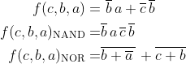

# 01 - gates

##nadpis druhé úrovne##
*gates*
##VHDL##
 ```vhdl

library ieee;               -- Standard library
use ieee.std_logic_1164.all;-- Package for data types and logic operations

------------------------------------------------------------------------
-- Entity declaration for basic gates
------------------------------------------------------------------------
entity gates is
    port(
        a_i    : in  std_logic;         -- Data input
        b_i    : in  std_logic;         -- Data input
        c_i	   : in  std_logic;			-- Data input
        f_o    : out std_logic;         -- OR output function
        fnand_o : out std_logic;         -- NAND output function
        fnor_o : out std_logic          -- NOR output function
    );
end entity gates;

------------------------------------------------------------------------
-- Architecture body for basic gates
------------------------------------------------------------------------
architecture dataflow of gates is
begin
    f_o  <= ((not b_i) and a_i) or ((not c_i) and (not b_i));
    fnand_o <= (a_i and (not b_i) and (not b_i) and (not c_i));
    fnor_o <= ((not ((not a_i) or b_i)) or (not(c_i or b_i)));

end architecture dataflow;

 ```
  
  
   
 
   
   &nbsp;

   | **c** | **b** |**a** |  | _{\textup{NAND}}) | _{\textup{NOR}}) |
   | :-: | :-: | :-: | :-: | :-: | :-: |
   | 0 | 0 | 0 | 1 | 1 | 1 |
   | 0 | 0 | 1 | 0 | 0 | 0 |
   | 0 | 1 | 0 | 0 | 0 | 0 |
   | 0 | 1 | 1 | 0 | 0 | 0 |
   | 1 | 0 | 0 | 1 | 1 | 1 |
   | 1 | 0 | 1 | 1 | 1 | 1 |
   | 1 | 1 | 0 | 0 | 0 | 0 |
   | 1 | 1 | 1 | 0 | 0 | 0 |
   
   
   
   
   _{\textup{NAND}})
   
   zkouska
   
   


   

   &nbsp;

   
    
   &nbsp;
    
   
    
   &nbsp;
   
    | **A** | **NOT** |
 | :-: | :-: |
 | 0 | 1 |
 | 1 | 0 |

   | **A** | **B** | **AND** | **NAND** |
   | :-: | :-: | :-: | :-: |
   | 0 | 0 | 0 | 1 |
   | 0 | 1 | 0 | 1 |
   | 1 | 0 | 0 | 1 |
   | 1 | 1 | 1 | 0 |

   | **A** | **B** | **OR** | **NOR** |
   | :-: | :-: | :-: | :-: |
   | 0 | 0 | 0 | 1 |
   | 0 | 1 | 1 | 0 |
   | 1 | 0 | 1 | 0 |
   | 1 | 1 | 1 | 0 |

   | **A** | **B** | **XOR** | **XNOR** |
   | :-: | :-: | :-: | :-: |
   | 0 | 0 | 0 | 1 |
   | 0 | 1 | 1 | 0 |
   | 1 | 0 | 1 | 0 |
   | 1 | 1 | 0 | 1 |


   

   &nbsp;

   
    
   &nbsp;
    
   
    
   &nbsp;

   | **A** | **B** |**C** |  |  |  |
   | :-: | :-: | :-: | :-: | :-: | :-: |
   | 0 | 0 | 0 | 1 | 1 | 1 |
   | 0 | 0 | 1 | 0 | 0 | 0 |
   | 0 | 1 | 0 | 0 | 0 | 0 |
   | 0 | 1 | 1 | 0 | 0 | 0 |
   | 1 | 0 | 0 | 1 | 1 | 1 |
   | 1 | 0 | 1 | 1 | 1 | 1 |
   | 1 | 1 | 0 | 0 | 0 | 0 |
   | 1 | 1 | 1 | 0 | 0 | 0 |
 

   
