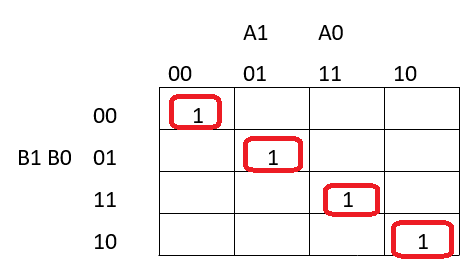
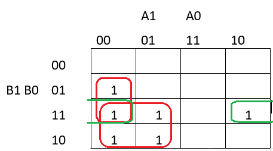
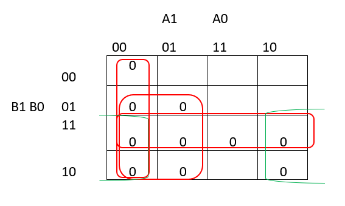
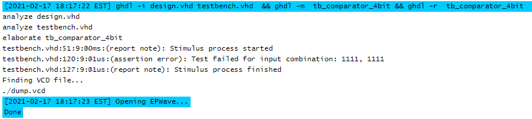

# 02-Logic


## Part 1 


| **Dec. equivalent** | **B[1:0]** | **A[1:0]** | **B is greater than A** | **B equals A** | **B is less than A** |
| :-: | :-: | :-: | :-: | :-: | :-: |
| 0 | 0 0 | 0 0 | 0 | 1 | 0 |
| 1 | 0 0 | 0 1 | 0 | 0 | 1 |
| 2 | 0 0 | 1 0 | 0 | 0 | 1 |
| 3 | 0 0 | 1 1 | 0 | 0 | 1 |
| 4 | 0 1 | 0 0 | 1 | 0 | 0 |
| 5 | 0 1 | 0 1 | 0 | 1 | 0 |
| 6 | 01 | 10 | 0 | 0 | 1 |
| 7 | 01 | 11 | 0 | 0 | 1 |
| 8 | 10 | 00 | 1 | 0 | 0 |
| 9 | 10 | 01 | 1 | 0 | 0 |
| 10 | 10 | 10 | 0 | 1 | 0 |
| 11 | 10 | 11 | 0 | 0 | 1 |
| 12 | 11 | 00 | 1 | 0 | 0 |
| 13 | 11 | 01 | 1 | 0 | 0 |
| 14 | 1 1 | 1 0 | 1 | 0 | 0 |
| 15 | 1 1 | 1 1 | 0 | 1 | 0 |

## Part 2 


### K-map equals 




### K-map greater_SoP:





### K-map less_PoS:





[https://www.edaplayground.com/x/8Ttz](https://www.edaplayground.com/x/8Ttz)

## Part 3 

###### design.vhd

```vhdl

library ieee;
use ieee.std_logic_1164.all;

------------------------------------------------------------------------
-- Entity declaration for 4-bit binary comparator
------------------------------------------------------------------------
entity comparator_4bit is
    port(
        a_i           : in  std_logic_vector(4 - 1 downto 0);
        b_i           : in  std_logic_vector(4 - 1 downto 0);
        


        -- COMPLETE ENTITY DECLARATION


        B_less_A_o      : out std_logic;        -- B is less than A
        B_equals_A_o    : out std_logic;		-- B equals A
        B_greater_A_o	: out std_logic			-- B is greater than A
        
    );
end entity comparator_4bit;

------------------------------------------------------------------------
-- Architecture body for 4-bit binary comparator
------------------------------------------------------------------------
architecture Behavioral of comparator_4bit is
begin
    B_less_A_o    <= '1' when (b_i < a_i) else '0';
	B_equals_A_o  <= '1' when (b_i = a_i) else '0';
    B_greater_A_o <= '1' when (b_i > a_i) else '0';


end architecture Behavioral;
```

###### testbench.vhd

```vhdl

library ieee;
use ieee.std_logic_1164.all;

------------------------------------------------------------------------
-- Entity declaration for testbench
------------------------------------------------------------------------
entity tb_comparator_4bit is
    -- Entity of testbench is always empty
end entity tb_comparator_4bit;

------------------------------------------------------------------------
-- Architecture body for testbench
------------------------------------------------------------------------
architecture testbench of tb_comparator_4bit is

    -- Local signals
    signal s_a       : std_logic_vector(4 - 1 downto 0);
    signal s_b       : std_logic_vector(4 - 1 downto 0);
    signal s_B_greater_A : std_logic;
    signal s_B_equals_A  : std_logic;
    signal s_B_less_A    : std_logic;

begin
    -- Connecting testbench signals with comparator_2bit entity (Unit Under Test)
    uut_comparator_4bit : entity work.comparator_4bit
        port map(
            a_i           => s_a,
            b_i           => s_b,
            B_greater_A_o => s_B_greater_A,
            B_equals_A_o  => s_B_equals_A,
            B_less_A_o    => s_B_less_A
        );

    --------------------------------------------------------------------
    -- Data generation process
    --------------------------------------------------------------------
    p_stimulus : process
    begin
        -- Report a note at the begining of stimulus process
        report "Stimulus process started" severity note;


        -- First test values
        s_b <= "0000"; s_a <= "0000"; wait for 100 ns;
        -- Expected output
        assert ((s_B_greater_A = '0') and (s_B_equals_A = '1') and (s_B_less_A = '0'))
        -- If false, then report an error
        report "Test failed for input combination: 00, 00" severity error;
                
         -- second test values
        s_b <= "0001"; s_a <= "0000"; wait for 100 ns;
        -- Expected output
        assert ((s_B_greater_A = '1') and (s_B_equals_A = '0') and (s_B_less_A = '0'))
        -- If false, then report an error
        report "Test failed for input combination: 0001, 0000" severity error;
        
          -- 3 test values
        s_b <= "0000"; s_a <= "0001"; wait for 100 ns;
        -- Expected output
        assert ((s_B_greater_A = '0') and (s_B_equals_A = '0') and (s_B_less_A = '1'))
        -- If false, then report an error
        report "Test failed for input combination: 0000, 0001" severity error;
        
        -- 4 test values
        s_b <= "0011"; s_a <= "0001"; wait for 100 ns;
        -- Expected output
        assert ((s_B_greater_A = '1') and (s_B_equals_A = '0') and (s_B_less_A = '0'))
        -- If false, then report an error
        report "Test failed for input combination: 0011, 0001" severity error;
        
         --  5 test values
        s_b <= "1000"; s_a <= "0000"; wait for 100 ns;
        -- Expected output
        assert ((s_B_greater_A = '1') and (s_B_equals_A = '0') and (s_B_less_A = '0'))
        -- If false, then report an error
        report "Test failed for input combination: 1000, 0000" severity error;
        
         --  6 test values
        s_b <= "0001"; s_a <= "0111"; wait for 100 ns;
        -- Expected output
        assert ((s_B_greater_A = '0') and (s_B_equals_A = '0') and (s_B_less_A = '1'))
        -- If false, then report an error
        report "Test failed for input combination: 0001, 0111" severity error;
        
         --  7 test values
        s_b <= "0110"; s_a <= "0000"; wait for 100 ns;
        -- Expected output
        assert ((s_B_greater_A = '1') and (s_B_equals_A = '0') and (s_B_less_A = '0'))
        -- If false, then report an error
        report "Test failed for input combination: 0110, 0000" severity error;
        
         --  8 test values
        s_b <= "0000"; s_a <= "1111"; wait for 100 ns;
        -- Expected output
        assert ((s_B_greater_A = '0') and (s_B_equals_A = '0') and (s_B_less_A = '1'))
        -- If false, then report an error
        report "Test failed for input combination: 0000, 1111" severity error;
        
         --  9 test values
        s_b <= "1110"; s_a <= "1111"; wait for 100 ns;
        -- Expected output
        assert ((s_B_greater_A = '0') and (s_B_equals_A = '0') and (s_B_less_A = '1'))
        -- If false, then report an error
        report "Test failed for input combination: 1110, 1111" severity error;
        
         --  10 test values
        s_b <= "1111"; s_a <= "1111"; wait for 100 ns;
        -- Expected output
        assert ((s_B_greater_A = '0') and (s_B_equals_A = '0') and (s_B_less_A = '0'))
        -- If false, then report an error
        report "Test failed for input combination: 1111, 1111" severity error;
  


        -- Report a note at the end of stimulus process
        report "Stimulus process finished" severity note;
        wait;
    end process p_stimulus;

end architecture testbench;
```

###### console output




[https://www.edaplayground.com/x/9zNp](https://www.edaplayground.com/x/9zNp)

