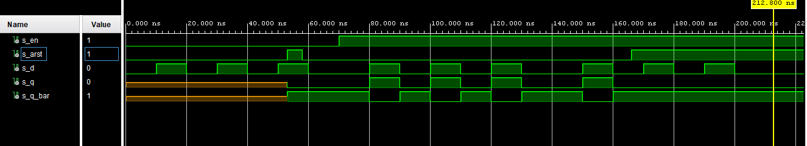

# Part 1


| **clk** | **d** | **q(n)** | **q(n+1)** | **Comments** |
| :-: | :-: | :-: | :-: | :-- |
|  | 0 | 0 | 0 |  |
|  | 0 | 1 | 1 |  |
|  | 1 | 1 | 1 |  |
|  | 1 | 1 | 0 |  |

| **clk** | **j** | **k** | **q(n)** | **q(n+1)** | **Comments** |
| :-: | :-: | :-: | :-: | :-: | :-- |
|  | 0 | 0 | 0 | 0 | No change |
|  | 0 | 0 | 1 | 1 | No change |
|  | 0 | 1 | 0 | 0 | Reset |
|  | 0 | 1 | 1 | 0 | Reset |
|  | 1 | 0 | 0 | 1 | Set |
|  | 1 | 0 | 1 | 1 | Set |
|  | 1 | 1 | 0 | 1 | Toggle |
|  | 1 | 1 | 1 | 0 | Toggle |

| **clk** | **t** | **q(n)** | **q(n+1)** | **Comments** |
| :-: | :-: | :-: | :-: | :-- |
|  | 0 | 0 | 0 | No change |
|  | 0 | 1 | 1 | No change |
|  | 1 | 0 | 1 | Toggle |
|  | 1 | 1 | 0 | Toggle |


# Part 2

##### VHDL code listing of the process `p_d_latch`

```vhdl
  p_d_latch : process (d, arst, en)
begin
    if (arst = '1') then
        q       <= '0';
        q_bar   <= '1';
        
    elsif (en = '1') then
        q       <= d;
        q_bar   <= not d;
        
    end if;
end process p_d_latch;
```

##### Listing of VHDL reset and stimulus processes from the testbench `tb_d_latch.vhd` file 

```vhdl
-------------------------------------------------------------------
    -- Reset generation process
    --------------------------------------------------------------------
​     p_reset_gen : process
​    begin
​        s_arst <= '0';
​        wait for 53 ns;
​        

        -- Reset activated
        s_arst <= '1';
        wait for 5 ns;
    
        -- Reset deactivated
        s_arst <= '0';
        wait for 108 ns;
        s_arst <= '1';
    
        wait;
    end process p_reset_gen;
    
    --------------------------------------------------------------------
    -- Data generation process
    --------------------------------------------------------------------
    p_stimulus : process
    begin
        report "Stimulus process started" severity note;
        
        s_en    <=  '0';
        s_d     <=  '0';
              
       wait for 10 ns;
       s_d  <= '1';
       wait for 10 ns;
       s_d  <= '0';
       wait for 10 ns;
       s_d  <=   '1';
       wait for 10 ns;
       s_d  <=  '0';
       wait for 10 ns;
       s_d  <=  '1';
       wait for 10 ns;
       s_d  <=  '0'; 
       wait for 10 ns;
       
       s_en  <=  '1';
       
       wait for 3 ns;
       
       assert (s_q = '0' and s_q_bar = '1')
       report "proces nefunguje" severity error;
       
       wait for 7 ns;
       s_d  <= '1';
       wait for 10 ns;
       s_d  <= '0';
       wait for 10 ns;
       s_d  <=   '1';
       wait for 10 ns;
       s_d  <=  '0';
       wait for 10 ns;
       s_d  <=  '1';
       wait for 10 ns;
       s_d  <=  '0'; 
       wait for 10 ns;
       
       assert (s_q = '0' and s_q_bar = '1')
       report "proces nefunguje" severity error;
       
       wait for 10 ns;
       s_d  <= '1';
       wait for 10 ns;
       s_d  <= '0';
       wait for 10 ns;
       s_d  <=   '1';
       wait for 10 ns;
       s_d  <=  '0';
       wait for 10 ns;
       s_d  <=  '1';
       wait for 10 ns;
       s_d  <=  '0'; 
       wait for 10 ns;


    report "Stimulus process finished" severity note;
    wait;
end process p_stimulus;
```
##### Screenshot with simulated time waveforms




# Part 3

#### d_ff_arst


```vhdl
 p_d_ff_arst : process (arst, clk)
    begin
    if (arst = '1') then
        q       <= '0';
        q_bar   <= '1';
        
    elsif rising_edge(clk) then
        q      <=   d;
        q_bar  <=   not d;
        
    end if;
end process p_d_ff_arst;
```

```vhdl
uut_d_ff_arst : entity work.d_ff_arst
    port map(
        clk   =>  s_clk_100MHz,   
        arst  =>  s_arst,   
        d     =>  s_d,    
        q     =>  s_q,    
        q_bar =>  s_q_bar
    
    );
    --------------------------------------------------------------------
    -- Clock generation process
    --------------------------------------------------------------------
    p_clk_gen : process
    begin
        while now < 750 ns loop         -- 75 periods of 100MHz clock
            s_clk_100MHz <= '0';
            wait for c_CLK_100MHZ_PERIOD / 2;
            s_clk_100MHz <= '1';
            wait for c_CLK_100MHZ_PERIOD / 2;
        end loop;
        wait;
    end process p_clk_gen; 
    
     --------------------------------------------------------------------
    -- Reset generation process
    --------------------------------------------------------------------
     p_reset_gen : process
    begin
        s_arst <= '0';
        wait for 53 ns;
        
        -- Reset activated
        s_arst <= '1';
        wait for 15 ns;

        -- Reset deactivated
        s_arst <= '0';

        wait;
    end process p_reset_gen;
    
    p_stimulus : process
    begin
        report "Stimulus process started" severity note;
        
       wait for 12 ns;
       s_d  <= '1';
       wait for 10 ns;
       s_d  <= '0';
       wait for 10 ns;
       s_d  <=  '1';
       wait for 10 ns;
       s_d  <=  '0';
       wait for 10 ns;
       s_d  <=  '1';
       wait for 10 ns;
       s_d  <=  '0'; 
       wait for 10 ns;
       s_d  <=  '1';
       wait for 10 ns;
       s_d  <=  '0'; 
       wait for 10 ns;
       s_d  <=  '1';
       wait for 10 ns;
       s_d  <=  '0'; 
       wait for 10 ns;
        report "Stimulus process finished" severity note;
        wait;
    end process p_stimulus;
```

#### d_ff_rst


```vhdl
architecture Behavioral of d_ff_rst is
        signal s_q  :   std_logic;
begin
        p_d_ff_rst : process (clk)
    begin
        if rising_edge(clk) then
            if (rst = '1') then
                s_q  <= '0';
            else 
               s_q <=  d;      
              end if;
        end if;

    end process p_d_ff_rst;

        q      <= s_q;
        q_bar  <= not s_q;
```

```vhdl
 -- Local constants
    constant c_CLK_100MHZ_PERIOD : time    := 10 ns;
    
    --Local signals
    signal s_clk_100MHz :std_logic; 
    signal s_rst       :std_logic;
    signal s_d          :std_logic;
    signal s_q          :std_logic;
    signal s_q_bar      :std_logic;

begin
    
    uut_d_ff_rst : entity work.d_ff_rst
    port map(
        clk   =>  s_clk_100MHz,   
        rst  =>  s_rst,   
        d     =>  s_d,    
        q     =>  s_q,    
        q_bar =>  s_q_bar
    
    );
    --------------------------------------------------------------------
    -- Clock generation process
    --------------------------------------------------------------------
    p_clk_gen : process
    begin
        while now < 750 ns loop         -- 75 periods of 100MHz clock
            s_clk_100MHz <= '0';
            wait for c_CLK_100MHZ_PERIOD / 2;
            s_clk_100MHz <= '1';
            wait for c_CLK_100MHZ_PERIOD / 2;
        end loop;
        wait;
    end process p_clk_gen; 
    
     --------------------------------------------------------------------
    -- Reset generation process
    --------------------------------------------------------------------
     p_reset_gen : process
    begin
        s_rst <= '0';
        wait for 53 ns;
        
        -- Reset activated
        s_rst <= '1';
        wait for 15 ns;

        -- Reset deactivated
        s_rst <= '0';

        wait;
    end process p_reset_gen;
    
    p_stimulus : process
    begin
        report "Stimulus process started" severity note;
        
       wait for 12 ns;
       s_d  <= '1';
       wait for 10 ns;
       s_d  <= '0';
       wait for 10 ns;
       s_d  <=  '1';
       wait for 10 ns;
        assert (s_q = '1' and s_q_bar = '0');
       s_d  <=  '0';
       wait for 10 ns;
       s_d  <=  '1';
       wait for 10 ns;
       s_d  <=  '0'; 
       wait for 10 ns;
       s_d  <=  '1';
       wait for 10 ns;
       s_d  <=  '0'; 
       wait for 10 ns;
       s_d  <=  '1';
       wait for 10 ns;
       s_d  <=  '0'; 
       wait for 10 ns;
       assert (s_q = '0' and s_q_bar = '1');
        report "Stimulus process finished" severity note;
        wait;
    end process p_stimulus;
```

#### jk_ff_rst


```vhdl
  p_jk_ff_rst : process (clk)
    begin
        if rising_edge(clk) then
            if (rst = '1') then
                s_q  <= '0';
            else 
               if (j = '0' and k = '0') then
                    s_q <= s_q;
               elsif (j = '0' and k = '1') then
                    s_q <= '0';
               elsif (j = '1' and k = '0') then
                     s_q <= '1';
               elsif (j = '1' and k = '1') then
                     s_q <= not s_q;      
              end if;
          end if;

        end if;
    end process p_jk_ff_rst;

        q      <= s_q;
        q_bar  <= not s_q;
    
                  
```

```vhdl
 --------------------------------------------------------------------
    -- Reset generation process
    --------------------------------------------------------------------
     p_reset_gen : process
    begin
        s_rst <= '0';
        wait for 53 ns;
        
        -- Reset activated
        s_rst <= '1';
        wait for 15 ns;

        -- Reset deactivated
        s_rst <= '0';

        wait;
    end process p_reset_gen;
    
    p_stimulus : process
    begin
        report "Stimulus process started" severity note;
        
       wait for 12 ns;
       s_j  <= '0';
       s_k  <= '0';
       wait for 20 ns;
       s_j  <= '0';
       s_k  <= '1';
   
      assert (s_q = '0' and s_q_bar = '1');
       
       wait for 20 ns;
       s_j  <= '1';
       s_k  <= '0';
       wait for 20 ns;
       s_j  <= '1';
       s_k  <= '1';
       
       assert (s_q = '1' and s_q_bar = '0');
       wait for 20 ns;
       
       s_j  <= '0';
       s_k  <= '0';
       wait for 20 ns;
       s_j  <= '0';
       s_k  <= '1';
       wait for 20 ns;
       s_j  <= '1';
       s_k  <= '0';
       wait for 20 ns;
       s_j  <= '1';
       s_k  <= '1';
       wait for 10 ns;
       
      s_j  <= '0';
       s_k  <= '0';
       wait for 20 ns;
       s_j  <= '0';
       s_k  <= '1';
       wait for 20 ns;
       s_j  <= '1';
       s_k  <= '0';
       wait for 20 ns;
       s_j  <= '1';
       s_k  <= '1';
       wait for 10 ns;
        report "Stimulus process finished" severity note;
        wait;
    end process p_stimulus;

```
#### t_ff_rst


```vhdl
 p_d_ff_rst : process (clk)
   begin
        if rising_edge(clk) then
            if (rst = '1') then
                s_q  <= '0';
            else 
               if (t = '0') then
                    s_q <= s_q;
               elsif (t = '1') then
                     s_q <= not s_q;      
              end if;
          end if;

        end if;

    end process p_d_ff_rst;

        q      <= s_q;
        q_bar  <= not s_q;
```

```vhdl
-- Clock generation process
    --------------------------------------------------------------------
    p_clk_gen : process
    begin
        while now < 750 ns loop         -- 75 periods of 100MHz clock
            s_clk_100MHz <= '0';
            wait for c_CLK_100MHZ_PERIOD / 2;
            s_clk_100MHz <= '1';
            wait for c_CLK_100MHZ_PERIOD / 2;
        end loop;
        wait;
    end process p_clk_gen; 
    
     --------------------------------------------------------------------
    -- Reset generation process
    --------------------------------------------------------------------
     p_reset_gen : process
    begin
        s_rst <= '0';
        wait for 53 ns;
        
        -- Reset activated
        s_rst <= '1';
        wait for 15 ns;

        -- Reset deactivated
        s_rst <= '0';

        wait;
    end process p_reset_gen;
    
    p_stimulus : process
    begin
        report "Stimulus process started" severity note;
        
       wait for 12 ns;
       s_t  <= '1';
       wait for 10 ns;
       s_t  <= '0';
       wait for 10 ns;
       s_t  <=  '1';
       wait for 10 ns;
        --assert (s_q = '1' and s_q_bar = '0');
       s_t  <=  '0';
       wait for 10 ns;
       s_t  <=  '1';
       wait for 10 ns;
       s_t  <=  '0'; 
       wait for 10 ns;
       s_t  <=  '1';
       wait for 10 ns;
       s_t  <=  '0'; 
       wait for 10 ns;
       s_t  <=  '1';
       wait for 10 ns;
       s_t  <=  '0'; 
       wait for 10 ns;
        report "Stimulus process finished" severity note;
        wait;
    end process p_stimulus;

```
# Part 4


